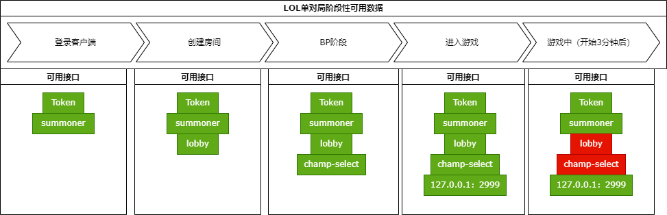

# Game Tools

一个PC游戏工具，现在只支持LOL。

目前产品功能：
- LOL BP实时展示。
- 创建所有LOL支持的游戏房间。

## 开发
1. 复制src_tauri下的assets并更名为local，保存本地数据
2. 运行`pnpm tauri dev`即可启动项目

## 对局流程
1. 打开客户端；
2. 创建房间；
3. 邀请双方队伍；
4. 开始游戏；
5. 进入BP；
6. 进入对局。

## 征召模式
### 比赛服
|  Ban位   | BP顺序  |
|  ----  | ----  |
| 10  | 左B2、右B2；左B1、右B1；左P1、右P2；左P、右P1、右B1；左B1、右B1；左B1、右P1；左P2、右P1 |

### 正式服

|  Ban位   | BP顺序  |
|  ----  | ----  |
| 6  | 单元格 |



以下为网络搜索到的资源参考：

问：LOL英雄联盟征召模式是什么？

答：第一阶段：禁选英雄

　　在选择英雄界面，双方队长各禁止本次对局玩家的所有可用英雄中的任意2个英雄，被禁止的英雄将无法在本次对局中出场。禁止顺序为1-2-1

　　如队长在禁止英雄时间内未做出禁止操作，则系统默认该队长不禁止英雄。

　　第二阶段：征召英雄

　　后禁止英雄的一方先征召英雄，队长先进行征召，然后按楼层顺序依次征召。在召唤者裂谷，征召会依照1-2-2-2-1的顺序进行。在扭曲森林（3V3图）会依照1-2-2-1的顺序进行。

　　无法征召被禁止的英雄和已被他人（含对方）征召的英雄。

　　第三阶段：调换英雄

　　选好英雄后，如您和某位队友均拥有双方所选的英雄，则队友头像边上会出现个交换的图标，点击后可交换双方所选英雄。此操作需要双方同意。

## 设计
仿LOL S13的BP界面。

按照16:9、宽度为1440px计算，高度应为810px，~~使用[rem.js](https://github.com/lanmerry/rem.js)自动计算px~~。

## windows下管理员权限cmd无法切换盘符
1. 方法一
如果是切换到D盘就执行：
```bash
cd /D D:\User
```
2. 方法二
如果是切换到D盘就执行：
```bash
d:
```
## Rust不能直接执行非Windows系统命令
https://github.com/rust-lang/rust/issues/95957

## LOL物料
图标链接地址：https://ddragon.leagueoflegends.com/cdn/13.23.1/img/<group>/<full>
游戏加载界面：https://ddragon.leagueoflegends.com/cdn/img/<group>/loading/<id>_0.jpg

游戏资源数据：https://github.com/CommunityDragon/Docs/blob/master/assets.md

```json
/* Anivia (id: 34) */
"spells": [
  {
    "id": "FlashFrost",
    "name": "Flash Frost",
    "description": "Anivia brings her wings together and summons a sphere of ice that flies towards her opponents, chilling and damaging anyone in its path. When the sphere explodes it does moderate damage in a radius, stunning anyone in the area.",
    "image": {
      "full": "FlashFrost.png",
      "sprite": "spell0.png",
      "group": "spell",
      "x": 192,
      "y": 144,
      "w": 48,
      "h": 48
    }
  },
  ...
]
```

## win禁止运行pnpm或npm
```bash
pnpm : 无法加载文件 C:\Users\username\AppData\Roaming\npm\pnpm.ps1，因为在此系统上禁止运行脚本。有关详细信息，请参阅 https:/go.microsoft.com/fwlink/?LinkID=135170 中的 about_Execution_Policies。
```
管理员权限运行powershell，执行`set-ExecutionPolicy RemoteSigned`，输入Y，即可解决。

## 获取客户端数据

接口地址：
- 旧的：https://lcu.vivide.re/
- 端口2999的：https://riotclient.nomi.dev/#/
- `/Help`接口返回的，当前游戏客户端支持的最新API。

```bash
wmic PROCESS WHERE name='LeagueClientUx.exe' GET commandline
```

c:/wegameapps/英雄联盟/LeagueClient/LeagueClientUx.exe "--riotclient-auth-token=dZ14Szqm70FGmO3NHV5u4Q" "--riotclient-app-port=59237" "--riotclient-tencent" "--no-rads" "--disable-self-update" "--region=TENCENT" "--locale=zh_CN" "--t.lcdshost=wt1-cloud-feapp.lol.qq.com" "--t.chathost=wt1-cloud-ejabberd.lol.qq.com" "--t.lq=https://wt1-cloud-login.lol.qq.com:8443" "--t.storeurl=https://wt1-cloud-sr.lol.qq.com:8443" "--t.rmsurl=wss://wt1-cloud-rms.lol.qq.com:443" "--rso-auth.url=https://prod-rso.lol.qq.com:3000" "--rso_platform_id=WT1_NEW" "--rso-auth.client=lol" "--t.location=loltencent.tjkg.WT1_NEW" "--tglog-endpoint=https://tglogsz.datamore.qq.com/lolcli/report/" "--t.league_edge_url=https://ledge-wt1cloud.lol.qq.com:22019" "--ccs=https://cc-wt1-cloud.lol.qq.com:8093" "--entitlements-url=https://wt1-entitlements.lol.qq.com:28088/api/token/v1" "--dradis-endpoint=http://some.url" "--remoting-auth-token=_BkC3zoDF6600gmlQdUs6w" "--app-port=58929" "--install-directory=c:\wegameapps\鑻遍泟鑱旂洘\LeagueClient" "--app-name=LeagueClient" "--ux-name=LeagueClientUx" "--ux-helper-name=LeagueClientUxHelper" "--log-dir=LeagueClient Logs" "--crash-reporting=" "--crash-environment=WT1_NEW" "--app-log-file-path=c:/wegameapps/英雄联盟/LeagueClient/../Game/Logs/LeagueClient Logs/2023-12-02T14-44-47_24992_LeagueClient.log" "--app-pid=24992" "--output-base-dir=c:/wegameapps/鑻遍泟鑱旂洘/LeagueClient/../Game" "--no-proxy-server" "--ignore-certificate-errors"

## 自动以管理员身份运行应用
https://github.com/tauri-apps/tauri/issues/7173#issuecomment-1584928815

## LCU Websocket
https://hextechdocs.dev/getting-started-with-the-lcu-websocket/

# 悠米or提莫
```json
{
  "version": "13.23.1",
  "id": "Teemo",
  "key": "17",
  "name": "迅捷斥候",
  "title": "提莫",
  "blurb": "不畏艰难险阻、不惧坎坷危途，提莫怀着无比的热情和欢欣的精神探索着整个世界。作为一个约德尔人，他对自己的道德观坚定不移，也对班德尔斥候的信条倍感自豪，有时候，过分的热忱甚至会让他无法看到自己的行为将会导致什么样的后果。虽然有人认为，“班德尔斥候小队”是否真实存在还有待商榷，但有一件事可以肯定，那就是提莫的信念。",
  "info": {
    "attack": 5,
    "defense": 3,
    "magic": 7,
    "difficulty": 6
  },
  "image": {
    "full": "Teemo.png",
    "sprite": "champion4.png",
    "group": "champion",
    "x": 48,
    "y": 48,
    "w": 48,
    "h": 48
  },
  "tags": [
    "Marksman",
    "Assassin"
  ],
  "partype": "法力",
  "stats": {
    "hp": 598,
    "hpperlevel": 104,
    "mp": 334,
    "mpperlevel": 25,
    "movespeed": 330,
    "armor": 24,
    "armorperlevel": 4.95,
    "spellblock": 30,
    "spellblockperlevel": 1.3,
    "attackrange": 500,
    "hpregen": 5.5,
    "hpregenperlevel": 0.65,
    "mpregen": 9.6,
    "mpregenperlevel": 0.45,
    "crit": 0,
    "critperlevel": 0,
    "attackdamage": 54,
    "attackdamageperlevel": 3,
    "attackspeedperlevel": 3.38,
    "attackspeed": 0.69
  }
}
```
```json
{
  "version": "13.23.1",
  "id": "Yuumi",
  "key": "350",
  "name": "魔法猫咪",
  "title": "悠米",
  "blurb": "作为一只来自班德尔城的魔法猫咪，悠米曾是一名约德尔魔女的守护灵，她的主人名叫诺拉。而当主人神秘消失以后，悠米就成为了《门扉魔典》的守护者，这是诺拉留下的一本有灵性的书，他们一起穿越书页中的传送门，共同寻找诺拉。渴望被宠爱的悠米在她的旅途中寻找着友善的同伴，为同伴们提供闪光护盾和坚决意志作为保护。虽然魔典竭尽全力让她把注意力留在最初的任务上，但悠米经常会被世俗的安逸所吸引，比如打盹和吃鱼。但安逸过后，她总是会回归自己的任务，找寻自己的朋友。",
  "info": {
    "attack": 5,
    "defense": 1,
    "magic": 8,
    "difficulty": 2
  },
  "image": {
    "full": "Yuumi.png",
    "sprite": "champion5.png",
    "group": "champion",
    "x": 336,
    "y": 0,
    "w": 48,
    "h": 48
  },
  "tags": [
    "Support",
    "Mage"
  ],
  "partype": "法力",
  "stats": {
    "hp": 500,
    "hpperlevel": 69,
    "mp": 440,
    "mpperlevel": 45,
    "movespeed": 330,
    "armor": 25,
    "armorperlevel": 4.2,
    "spellblock": 25,
    "spellblockperlevel": 1.1,
    "attackrange": 425,
    "hpregen": 5,
    "hpregenperlevel": 0.55,
    "mpregen": 10,
    "mpregenperlevel": 0.4,
    "crit": 0,
    "critperlevel": 0,
    "attackdamage": 49,
    "attackdamageperlevel": 3.1,
    "attackspeedperlevel": 1,
    "attackspeed": 0.625
  }
}
```